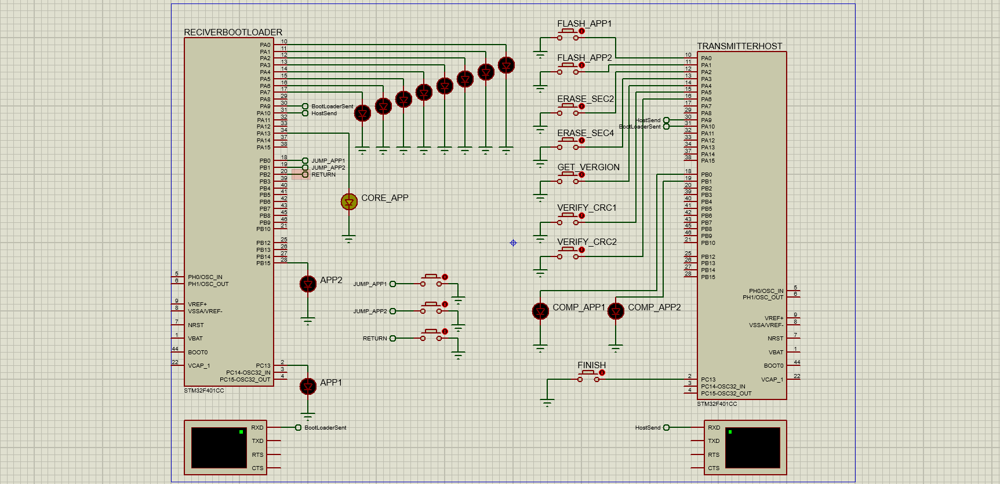

# FinalProjectOla-Mariam

# Bootloader Data Transmission Project



## Overview

This project demonstrates a Bootloader system using UART communication between a Host microcontroller and a Receiver microcontroller. The system is designed to enter a waiting state for a few seconds, allowing the Receiver to check for an interrupt signal. If an interrupt is detected, the Receiver switches to **M mode**, where it can receive commands sent from the Transmitter. If no interrupt is received within the specified time, the Receiver sends an "x" and enters the **Core Application Mode**. Once in **M mode**, the Receiver can perform tasks like flashing firmware, erasing memory, verifying CRC, and more. The Receiver can exit **M mode** by pressing the "Finish" button (Pin 13C on the Transmitter).

## Features

- **Interrupt-Driven Bootloader**: The Receiver waits for an interrupt signal. If an interrupt is detected, it enters **M mode** to receive commands.
- **M Mode Operations**: In **M mode**, the Receiver can receive specific commands sent from the Transmitter to perform various operations such as:
  - **Flash Firmware**: The Receiver can flash Code 1 or Code 2.
  - **Erase Memory**: Erase the current memory in the Receiver.
  - **Verify CRC**: Check the integrity of the received data using CRC.
  - **Exit M Mode**: To exit **M mode**, the "Finish" button (Pin 13C) on the Transmitter must be pressed.
- **Timeout Handling**: If no interrupt is received during the waiting period, the system sends "x" and transitions to the **Core Application Mode**.
- **Core Application Mode**: After the timeout, the system enters the **Core Application Mode**, where it performs normal operations, like blinking LED on Pin 13A.

## Getting Started

### Prerequisites

- Two ARM Cortex-M microcontrollers (or similar platforms):
  - **Host**: Sends commands and manages the Bootloader process.
  - **Receiver**: Enters Bootloader mode and performs operations like flashing, erasing, verifying CRC, etc.
- UART communication setup between Host and Receiver.
- STM32CubeIDE or any compatible IDE for development.

### Installation

1. Clone the repository:

   ```bash
   git clone https://github.com/ola-saadeh/FinalProjectOla-Mariam.git
   cd FinalProjectOla-Mariam
   sending specific commands (like erasing data), and verifying the integrity of the data through CRC.
   ```

### Host Setup:

Flash the host_main.hex code to the Host microcontroller.
Configure UART communication and interrupts to send commands to the Receiver.

### Receiver Setup:

Flash the receiver_bootloader.hex code to the Receiver microcontroller.
Set up the Bootloader to handle interrupts, enter M mode, and perform operations based on commands.
Usage

## Usage

### Interrupt Waiting Period:

Upon reset, the Receiver enters a waiting period (e.g., a few seconds) for an interrupt signal.
If no interrupt is received during this period, the system sends an "x" and transitions to the Core Application Mode.

### Entering M Mode:

If an interrupt is detected during the waiting period, the Receiver enters M mode.
The Receiver will now accept commands sent from the Transmitter via UART. Commands can include:
Flash Firmware: Flash either Code 1 or Code 2 onto the Receiver.
Erase Memory: Erase the current memory of the Receiver.
Verify CRC: Perform CRC verification for data integrity.

### Exiting M Mode:

To exit M mode, the Finish button (Pin 13C on the Transmitter) must be pressed. This signals the Receiver to exit M mode and return to normal operation.

### Core Application Mode:

If no interrupt is detected during the waiting period, the system sends an "x" and enters the Core Application Mode.
In this mode, the Receiver can perform normal operations like blinking an LED on Pin 13A.

## Project Structure

Directories

- TransmitterHost:

  - **src/**: The source code files for the Host, responsible for UART communication and command transmission.

- ReceiverBootloader:

  - **src/**: The source code files for the Receiver Bootloader, handling interrupts and M mode operations.

- Project Practical Files

  - **FinalProjectOM.pdsprj**: Main project file for the STM32 development environment Proteus v8.13.

## Authors

- **Ola & Mariam** - [GitHub Profile](https://github.com/ola-saadeh)
